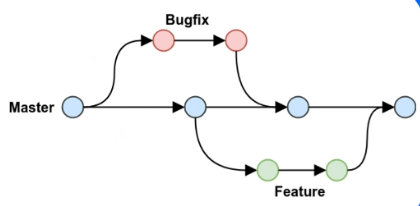
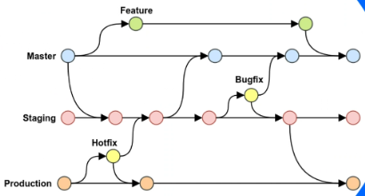
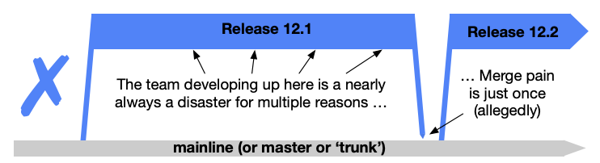
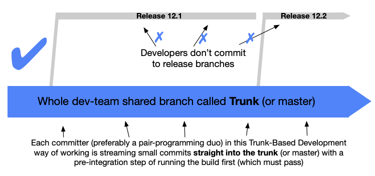
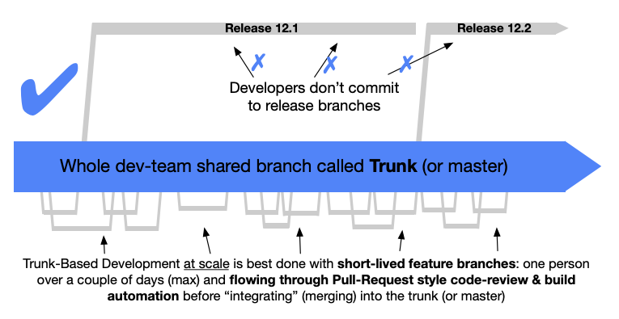

# hello-world of development
Here I will document the lessons I learn regarding many major aspects of development which includes the following:

## Git

    
more info

     
      The Git section will cover 4 main Git branching strategies.
     
     
    

      
GitFlow

       
        A strategy ideal for intricate projects, organizes development and releases across multiple branches. Supports parallel feature feature development, streamlined release management, and a clear path for hotfixes.
       
       
      With this flow we maintain 5 types of branches:  
      
1. Main: Stable, direct to production. 
2. Develop: Unstable, all feature changes will be pushed here. 
3. Feature: Check out from Develop branch, and push changes to it. 
4. Hotfix: Check out from Main, push changes to main and develop. 
5. Release: Semi-stable, ready to release, following with a few bugfixes. Checkout from Develop and push to both Main and Develop.  
      Drawbacks are maintaining a Develop branch long-term. Also changes in Hotfix and Release need to push to both Main and Develop for sync. The git history would look very messy and hard to follow.  
      GitFlow Workflow: 
    
    
    

       
      

      
GitHub Flow

       
      GitHub Flow is a simple, lightweight strategy for small teams and quick relases. It emphasizes small teams and quick releases. It also emphasizes small, frequent commits to the main branch, ensuring it's always deployable. This stategy is flexible and promotes fast feedback loops.
       
       
      With this flow we maintain main and usually other branches accompanying it like bug fixes and features branches.  
      GitHub Workflow: 
    
    
    

       
    

      
GitLab Flow

       
      GitLab Flow is robust and scalable, suitable for large projects. It focuses on a single, protected main branch, integrating continious integration and automated testing to ensure stability. While this is like GitHub flow, having environment branches is a big difference.
       
       
      With this flow there are two different types of release cycles: 

    1. Versioned Release: each release has an associated release branch that is based off the main branch. Bug fixes should be merged into the main branch first, before cherry-picked into the release branch. 
    2. Continuous Release: production branches are utlilized to contain deployment-ready code, so code is merged into production branch when it's ready to be released.  
        GitLab Workflow: 

    
    

       
    

      
Trunk-Based Development

       
      TBD involves direct merges to a shared trunk branch, aiming for frequent, small changes to maintain a releasable state. It reduced merge conflicts and encourages collaboration but can be complex for large teams.
       
       
      With this flow there a many different styles or methods suited to specific circumstances: 
## The first being what not to do
### Shared branches off mainline/main/trunk are bad at any release cadence: 
  
## The second and third being applicable to specific use cases
### Trunk-Based Development For Smaller-Teams: 
  
### Scaled Trunk-Based Development: 
  
    

       

 

## CLI

  
more info

   
  Pending lesson on 03/04/2024

 

## Testing

  
more info

   
  Pending lesson on 03/11/2024

 

## CI/CD

  
more info

   
  Pending lesson on 03/18/2024

 

## Deploy

  
more info

     
    Pending lesson on 03/25/2024

 
