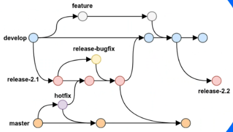

# hello-world of development
Here I will document the lessons I learn from Sheldon regarding many major aspects of development which includes the following:

## Git

    
more info

     
      The Git section will cover 4 main Git branching strategies.
     
     
    

      
GitFlow

       
        A strategy ideal for intricate projects, organizes development and releases across multiple branches. Supports parallel feature feature development, streamlined release management, and a clear path for hotfixes.
       
       
      With this flow we maintain 5 types of branches:  
      Main: Stable, direct to production. 
      Develop: Unstable, all feature changes will be pushed here. 
      Feature: Check out from Develop branch, and push changes to it. 
      Hotfix: Check out from Main, push changes to main and develop. 
      Release: Semi-stable, ready to release, following with a few bugfixes. Checkout from Develop and push to both Main and Develop.  
      Drawbacks are maintaining a Develop branch long-term. Also changes in Hotfix and Release need to push to both Main and Develop for sync. The git history would look very messy and hard to follow.
    

       
      

      
GitHub Flow

       
       
       
    

       
    

      
GitLab Flow

       
    

       
    

      
Trunk-Based Development

       
    

       
    GitFlow Workflow: 
    

 

## CLI

  
more info

   
  Pending lesson on 03/04/2024

 

## Testing

  
more info

   
  Pending lesson on 03/11/2024

 

## CI/CD

  
more info

   
  Pending lesson on 03/18/2024

 

## Deploy

  
more info

     
    Pending lesson on 03/25/2024

 
